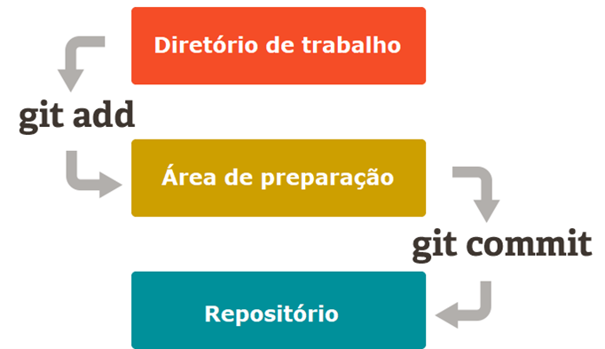
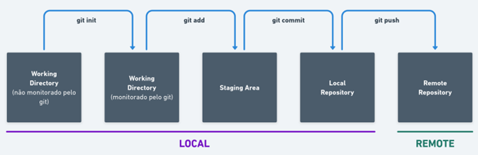
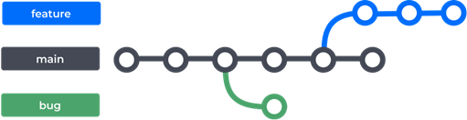

## task02-git-pedrosousa

Inicialmente entendi o motivo da utilização do Git, que é um sistema para controle de versão. Com ele é possível ter o projeto remotamente e um clone local. Com o clone local é permitido trabalhar de modo offline (fazer modificações, adicionar recursos, correções), em uma versão do projeto que parte da remota, sem que altere diretamente no repositório remoto.

Através do clone local (no computador de quemm está colaborando) consegue-se uma comunicação com o repositório remoto para salvar as alterações. Mas essa ligação entre os dois repositórios não são diretamente conectados, o processo de alteração no local funciona da seguinte forma: 

Primeiramente, após ter iniciado o repositório local (estando no diretório e usando o comando **__git init__**) ou feito o clone do remoto, trabalhamos no Diretório de Trabalho (ou Working Directory), tendo feito as alterações (salvando-as) -> enviamos para a Área de preparação (ou Stanging Area) com o comando **__git add__**, que é como uma sala de espera antes de efetivamente enviar as alterações no repositório -> Para enviar ao Repositório local (ou Git Directory) utilizamos o comando **__git commit__**, esse comando marca o estado atual do repositório.

Esse é o processo de utilização do repositório local, visto que para usar o Git não necessáriamente precisamos de ter um repositório remoto. 

Através de ferramentas online para hospedagem de repositórios git (como GitHub e BitBucket por exemplo) conseguimos criar um repositório remoto, para que possamos trabalhar com outras pessoas ao mesmo tempo em um mesmo projeto. Com o remoto, o processo funciona da seguinte forma:

Após ter salvo as atualizações no repositório local, enviamos para o remoto com o **__git push__**.

Na aula aprendemos a criar um repositório, adicionar colaboradores e criar clone local, com o GitHub. 

Entrando na questão da utilização prática do Git, trabalhamos Branches, que é uma ramificação do último commit da main, ou de outra branch. As Branches são muito importantes, pois são uma cópia do projeto onde podemos aplicar correções, fazer modificações, testes, features etc. sem alterar na main (branch principal).

Para criar uma branch:

**__git checkout -b <nome-da-branch>__**

Para navegar entre branches:

**__git checkout <nome-da-branch>__**

Obs.: sempre que se cria uma branch e envia deseja enviar ao repositório remoto, (somente no primeiro push) o git pedirá o comando:  

**__git push --set-upstream origin__**

Para saber quais branchs estão no projeto, pode-se usar o comando: 

**__git branch__**

__Obs.: ele destaca a branch que estamos.__

### Sobre alguns comandos que aprendemos: 

**__git status__** para ver a situação atual da branch em que estamos.

**__git fetch__** que é utilizado para buscar branches e/ou tags com os objetos necessários criados a partir de outro repositório distribuído (e que foi enviado para o remoto). É como buscar atualizações.

**__git pull__** para aplicar as atualizações do repositório remoto.

